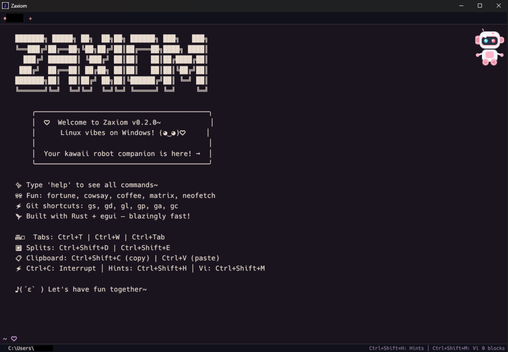

<div align="center">

# Zaxiom

**A modern terminal for Windows, built in Rust**

[](https://www.rust-lang.org/)
[](LICENSE)
[](https://github.com/aayushadhikari7/zaxiom)

```
 ███████╗ █████╗ ██╗  ██╗██╗ ██████╗ ███╗   ███╗
 ╚══███╔╝██╔══██╗╚██╗██╔╝██║██╔═══██╗████╗ ████║
   ███╔╝ ███████║ ╚███╔╝ ██║██║   ██║██╔████╔██║
  ███╔╝  ██╔══██║ ██╔██╗ ██║██║   ██║██║╚██╔╝██║
 ███████╗██║  ██║██╔╝ ██╗██║╚██████╔╝██║ ╚═╝ ██║
 ╚══════╝╚═╝  ╚═╝╚═╝  ╚═╝╚═╝ ╚═════╝ ╚═╝     ╚═╝
```

*Linux vibes on Windows* ✨



</div>

---

## 💡 Why Zaxiom?

Most Windows terminals feel clunky or lack proper Unix-style tooling. Zaxiom brings the best of both worlds:

- ⚡ **Blazingly fast** — 100+ commands implemented natively in Rust
- 🖥️ **Full PTY support** — Run vim, ssh, node REPLs, and interactive CLI tools seamlessly
- 🛠️ **Developer-friendly** — Git integration, intelligent autocomplete, syntax highlighting
- 🎨 **Beautiful** — 20 built-in themes and a kawaii robot companion

---

## 🚀 Quick Start

```powershell
git clone https://github.com/aayushadhikari7/zaxiom
cd zaxiom
.\install.ps1
```

Or build manually:

```bash
cargo build --release
```

---

## ✨ Features

### Terminal Emulation
| | Feature | Description |
|--|---------|-------------|
| 🖥️ | **PTY Support** | Full ConPTY integration for interactive apps |
| 📑 | **Tabs & Splits** | Multi-pane workflow with keyboard shortcuts |
| 💬 | **Autocomplete** | Context-aware suggestions for commands, paths, git branches |
| 🔍 | **Fuzzy Search** | Ctrl+R for history, Ctrl+Shift+F for files, Ctrl+G for branches |
| ⌨️ | **Vi Mode** | Vim-style navigation in scrollback buffer |

### 📦 Built-in Commands

All your favorite Unix commands, implemented in Rust for speed:

| | Category | Commands |
|--|----------|----------|
| 📂 | Navigation | `ls` `cd` `pwd` `tree` `clear` |
| 📄 | Files | `cat` `cp` `mv` `rm` `mkdir` `touch` `chmod` `nano` |
| 📝 | Text | `grep` `find` `head` `tail` `wc` `sort` `sed` `awk` `cut` `diff` |
| 💻 | System | `ps` `kill` `df` `du` `whoami` `uname` `neofetch` |
| 🌐 | Network | `curl` `wget` `ping` |
| 🗜️ | Compression | `tar` `zip` `gzip` `gunzip` |
| 🔐 | Hash | `md5sum` `sha256sum` `blake3sum` `base64` |

### 🔧 External Tool Support

Seamlessly run your development tools:

| | Category | Tools |
|--|----------|-------|
| 🟨 | JavaScript | `npm` `yarn` `pnpm` `bun` `node` `deno` |
| 🦀 | Rust | `cargo` `rustc` `rustup` |
| 🐍 | Python | `python` `pip` `uv` `poetry` |
| 🐳 | Containers | `docker` `kubectl` `terraform` |
| 🔀 | Version Control | `git` `gh` `ssh` |

---

## ⌨️ Keyboard Shortcuts

### Navigation
| Shortcut | Action |
|----------|--------|
| `Ctrl+T` | New tab |
| `Ctrl+W` | Close tab/pane |
| `Ctrl+Tab` | Next tab |
| `Ctrl+1-9` | Jump to tab |

### Splits
| Shortcut | Action |
|----------|--------|
| `Ctrl+Shift+D` | Split horizontal |
| `Ctrl+Shift+E` | Split vertical |
| `Alt+Arrows` | Navigate panes |

### Productivity
| Shortcut | Action |
|----------|--------|
| `Tab` | Autocomplete |
| `Ctrl+R` | Fuzzy search history |
| `Ctrl+F` | Search output |
| `Ctrl+Shift+M` | Vi mode |
| `Ctrl+Shift+H` | Hints mode (extract URLs, paths) |

---

## 🎨 Themes

Switch themes instantly with `theme <name>`:

| | | |
|--|--|--|
| 🌸 Catppuccin Mocha *(default)* | ❄️ Nord | 🧛 Dracula |
| 🌃 Tokyo Night | 🟤 Gruvbox | ⚫ One Dark |
| ☀️ Solarized | 🎨 Monokai Pro | 🌹 Rose Pine |
| 🌊 Kanagawa | 🌲 Everforest | 🦉 Night Owl |

Enable kawaii mode for extra flair: `theme --kawaii` ✨

---

## 🏗️ Architecture

```
src/
├── app.rs           # Main application and UI
├── pty/             # PTY session, terminal grid, ANSI parsing
├── terminal/        # Buffer, history, autocomplete, splits
├── shell/           # Parser and executor
├── commands/        # Built-in command implementations
└── config/          # Themes and settings
```

---

## 🤝 Contributing

Contributions are welcome! Feel free to:

- 🐛 Report bugs or request features via [Issues](https://github.com/aayushadhikari7/zaxiom/issues)
- 🔧 Submit pull requests
- 💬 Share feedback

---

## 🔮 Roadmap

Stay tuned for more updates and features! This project is actively developed and there's more to come.

---

## 📄 License

[MIT](LICENSE) — Built with 🦀 Rust + egui
